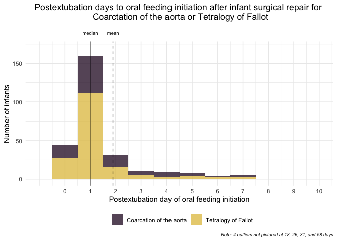

RQ 1 Visualizations
================

``` r
# Read in data
df_final <- read_rds("./source/df_final.rds")
```

### RQ1 data visualization \#1

On average, how long (days) did it take to initiate the first oral feed
in the ICU after extubation?

``` r
p <- ggplot() +
  geom_histogram(data = df_final, aes(x = enteral_d_oral_initiate_day, 
                    fill = diagnosis),
                bins = 10, alpha = 0.8)  +
  scale_fill_manual(name = "Diagnosis", 
                    labels = c("Coarcation of the aorta",
                               "Tetralogy of Fallot"),
                      values = c(CoA = "#371c38", ToF = "#e3c559")) +
  theme_minimal() +
  theme(
    plot.title = element_text(hjust = 0.5, margin = margin(0,0,30,0)),
    plot.caption = element_text(face = "italic", size = 6),
    legend.position = "bottom") +
  scale_x_continuous(breaks = seq(0, 10, 1), lim = c(0 , 10)) +
  labs(title = "Days to initiation of oral feeding after infant surgical repair for \n Coarctation of the aorta or Tetralogy of Fallot",
       caption = "Note: 4 outliers not pictured at 18, 26, 31, and 58 days") +
  xlab("Day of oral feeding initiation") +
  ylab("Number of infants") 
  scale_fill_brewer(name = "Cut Grade", 
                    labels = c("Very Bad", "Bad", 
                               "Mediocre", "Nice", "Very Nice"))
```

    ## <ggproto object: Class ScaleDiscrete, Scale, gg>
    ##     aesthetics: fill
    ##     axis_order: function
    ##     break_info: function
    ##     break_positions: function
    ##     breaks: waiver
    ##     call: call
    ##     clone: function
    ##     dimension: function
    ##     drop: TRUE
    ##     expand: waiver
    ##     get_breaks: function
    ##     get_breaks_minor: function
    ##     get_labels: function
    ##     get_limits: function
    ##     guide: legend
    ##     is_discrete: function
    ##     is_empty: function
    ##     labels: Very Bad Bad Mediocre Nice Very Nice
    ##     limits: NULL
    ##     make_sec_title: function
    ##     make_title: function
    ##     map: function
    ##     map_df: function
    ##     n.breaks.cache: NULL
    ##     na.translate: TRUE
    ##     na.value: NA
    ##     name: Cut Grade
    ##     palette: function
    ##     palette.cache: NULL
    ##     position: left
    ##     range: <ggproto object: Class RangeDiscrete, Range, gg>
    ##         range: NULL
    ##         reset: function
    ##         train: function
    ##         super:  <ggproto object: Class RangeDiscrete, Range, gg>
    ##     rescale: function
    ##     reset: function
    ##     scale_name: brewer
    ##     train: function
    ##     train_df: function
    ##     transform: function
    ##     transform_df: function
    ##     super:  <ggproto object: Class ScaleDiscrete, Scale, gg>

``` r
# Create df with mean and median 
df_stats <- df_final %>% 
  summarize(mean = mean(enteral_d_oral_initiate_day),
            median = median(enteral_d_oral_initiate_day)) 


p + 
  geom_vline(data = df_stats, aes(xintercept = mean), col = "black", linetype = "dashed", alpha = 0.5) +
  geom_vline(data = df_stats, aes(xintercept = median), col = "black", linetype = "solid", alpha = 0.5) +
  annotate("text", x = 1, y = 190, label = "mean", size = 2.5) +
  annotate("text", x = 1.90, y = 190, label = "median", size = 2.5) +  
  coord_cartesian(ylim = c(0, 170), clip = "off")
```



``` r
    annotate("text", x = 1, y = 200, label= "mean = 1", size =3)
```

    ## mapping: x = ~x, y = ~y 
    ## geom_text: na.rm = FALSE
    ## stat_identity: na.rm = FALSE
    ## position_identity

### RQ1 data visualization \#2

At what times of day was initiation of oral feeding most common?
